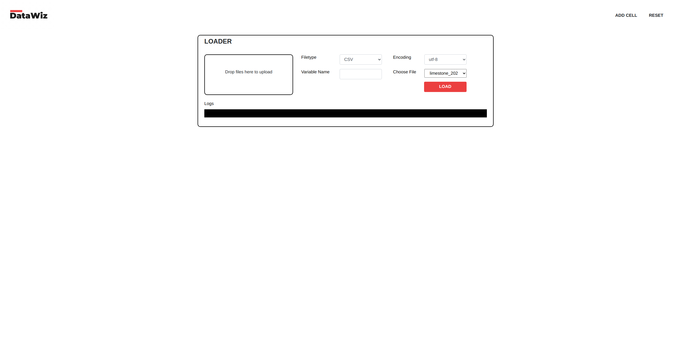
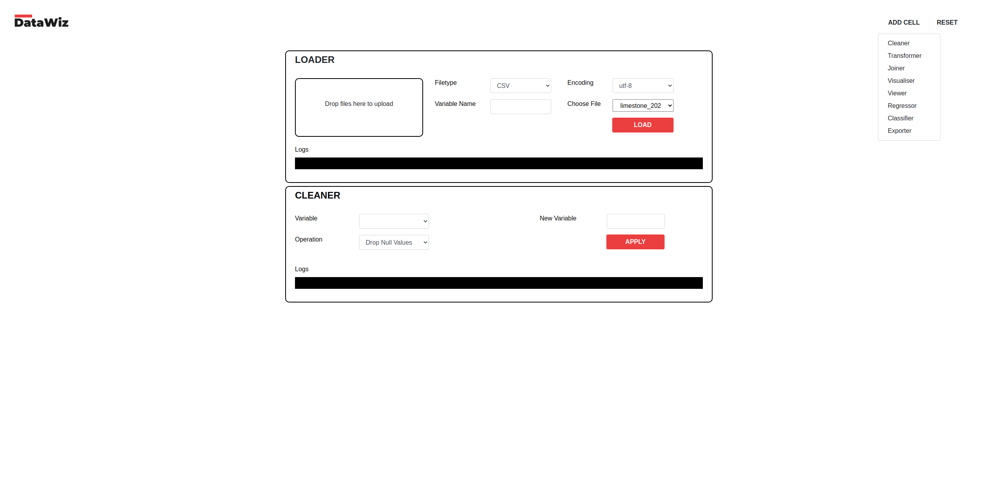
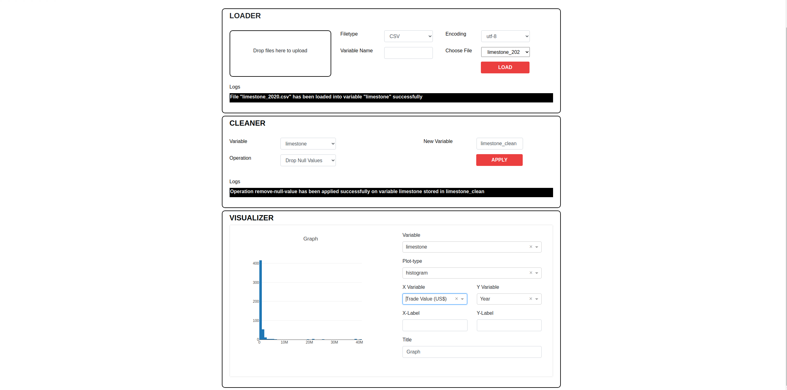
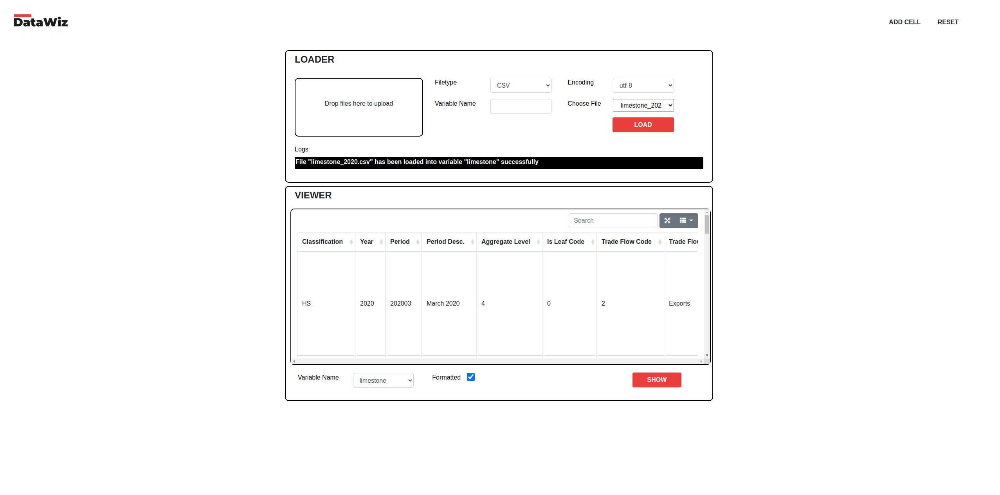
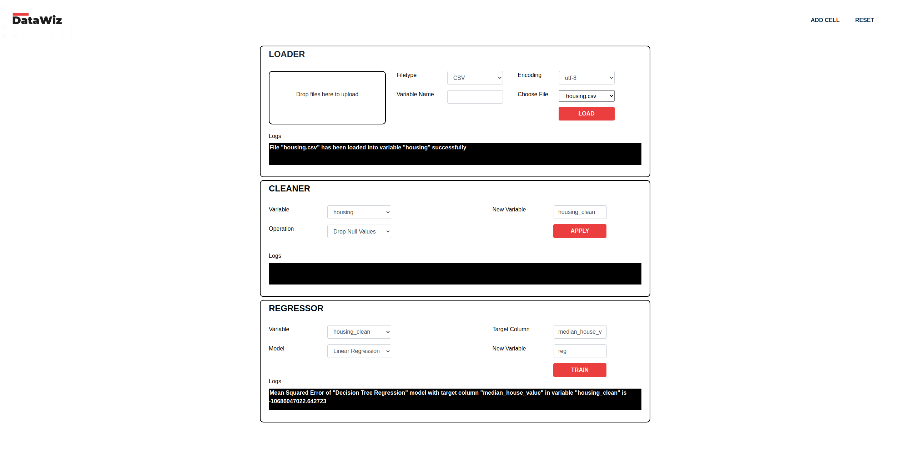
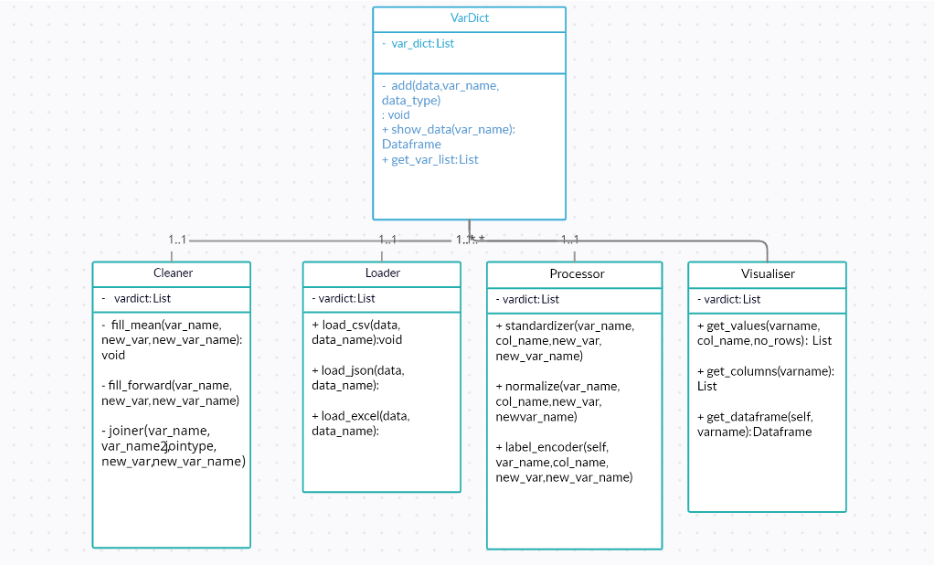
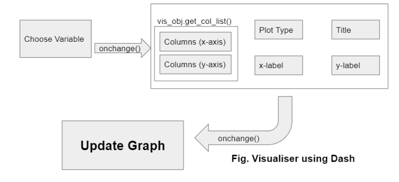

  


## Project Overview
A GUI application to perform tasks such as data cleaning, data engineering and machine learning without writing any code.
It is a data prototyping tool for students and researchers to do prelimnary analysis of their dataset.

## Featues
* Data Imports in CSV, JSON, XLSX and HTML format.
* Null Values imputation with Fill Forward, Fill Backward, Fill Median, Fill Mean and Drop.
* Preprocessors like Label Encoding, Normalizer and Standardizer.
* Horizontal and Vertical Joins of Dataset
* Visualizations like Line Chart, Bar Chart, Pie Chart and Histogram.
* View dataset as a table.
* Regression Algorithms supported: Linear Regression, Support Vector Machine (SVM), Decision Trees, Random Forest and K-Nearest Neighbors (KNN).
* Classification Algorithms supported: Logistic Regression, Support Vector Machine (SVM), Decision Trees, Random Forest and K-Nearest Neighbors (KNN).
* Data Exports in CSV, JSON, XLSX and HTML format.

## Screenshots






## TechStack
* Python
* Django
* Dash
* Plot.ly
* Pandas
* Scikit-learn
* Bootstrap
* HTML
* CSS
* JS

## Diagrams
### Class Diagram


### Visulalization using Django Dash


## Contributors
* [Avnish Pal](www.github.com/bovem)
* [Vishnu P](https://github.com/vishnu0179)
* [Nitesh Nanda](https://github.com/niteshnanda02)
* [Varun Rawat]()
* [Harsh Chamoli]()

## Setup
**NOTE:** Use powershell on Windows for this setup.

1. Install Docker
2. Change directory for datawiz.
```
cd datawiz/
```
3. Add executable permissions for [executor.sh](./datawiz/executor.sh).  
```
chmod +x ./executor.sh
```
4. Execute
```
./executor.sh
```